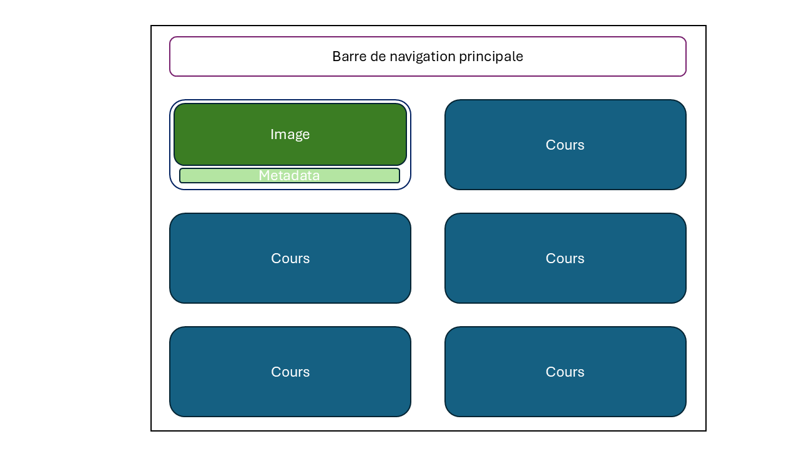
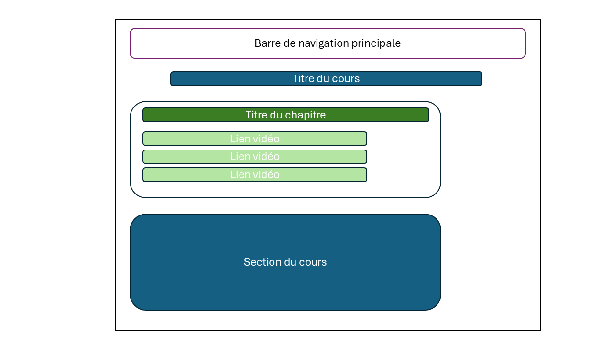
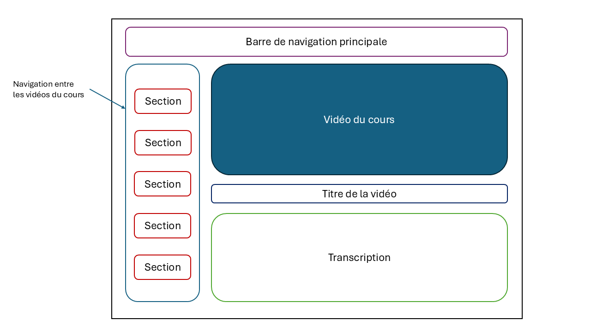
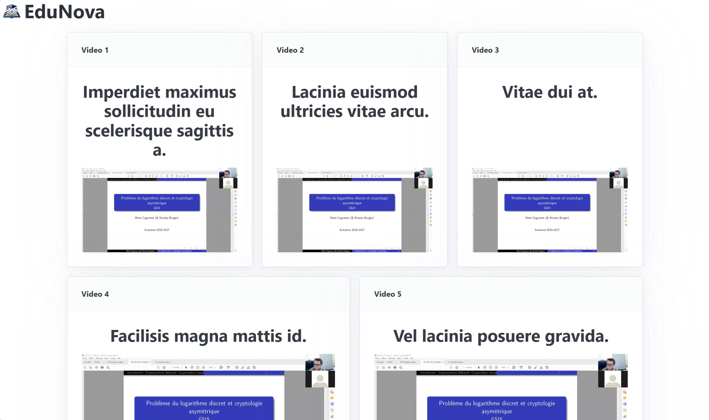
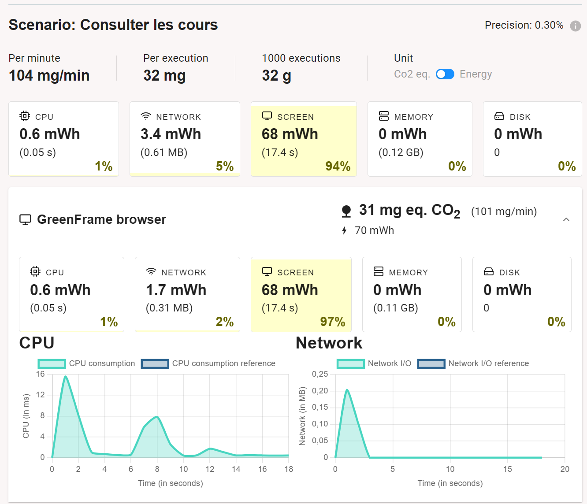
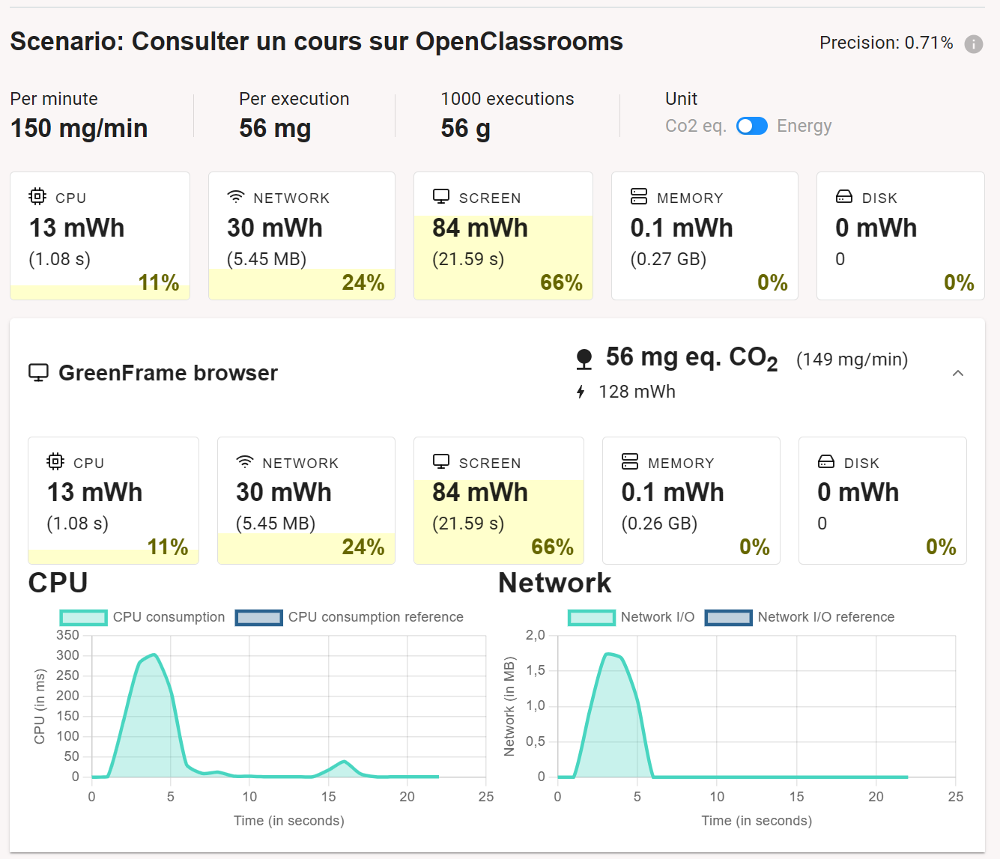

# EduNova
Plateforme d'apprentissage en ligne soucieuse de son impact écologique.

## Unis par l’apprentissage autonome et accessible
Nous serons, en tant que futurs ingénieurs, intégrés à un environnement de travail en constante évolution. Nous avons besoin de pouvoir monter en compétences et de suivre les dernières tendances de notre secteur d’activités.

Nous sommes également, en tant que jeunes adultes, des personnes curieuses de se développer personnellement et de s’investir dans divers loisirs.

L’apprentissage en ligne représente pour nous une activité fréquente et indispensable. Au-delà de nos usages personnels, le marché du e-learning concerne également les entreprises, les salariés et les universités. Il s'agit d'une bonne option pour les entreprises qui veulent former leurs employés à Python par exemple. C’est un marché en forte croissance (croissance d’environ 10% par an depuis 2020), et qui touche de plus en plus de catégories socio-économiques. C’est pourquoi il nous a semblé intéressant d’essayer de réduire son impact écologique.

## L’apprentissage en ligne pour favoriser l’éducation
L’éducation est un pilier de la société. Elle permet :
-	le développement économique du territoire,
-	l’insertion des individus dans les activités de la société,
-	d’améliorer la stabilité sociale (transmission de valeurs, esprit critique, individus plus responsables, …).

L’éducation est une ressource qui peut s’avérer difficile d’accès. Néanmoins, 2/3 de la population mondiale à aujourd’hui accès à Internet. L’apprentissage en ligne s’impose alors comme un moyen naturel d’améliorer l’accessibilité et la diffusion du savoir à plus grande échelle, pour améliorer l’accès à l’éducation.

## Impact écologique de la numérisation de l’éducation
A première vue, la transition numérique de l’éducation et des formations tendrait à réduire l'empreinte carbone des formations / séminaires, quantifiée en moyenne par :
- 50g de CO2 par passager par km pour le transport ([Rapport ADEME](https://impactco2.fr/outils/transport)),
- 10kg de CO2 par personne par nuit pour l’hébergement et la restauration ([Rapport ADEME](https://nosgestesclimat.fr/documentation/logement/vacances/empreinte-hotel-par-nuit)),
- utilisation de support (papier ou numériques) difficile à quantifier.

Cependant, l’éducation en ligne créé un flux numérique qui est à considérer. De plus, son but intrinsèque est d’être le plus démocratisé possible, et ce projet peut-être soumis à un potentiel effet rebond. Pour limiter ces facteurs qui rendraient le projet moins impactant, il est important de réfléchir :
-	au format utilisé,
-	au tradeoff entre élagage/épuration de fonctionnalités et utilisabilité pour rester concurrentiel,
-	à proposer des solutions de téléchargement plutôt que de streaming, et héberger le contenu au plus près de l'utilisateur,
-	à des pôles géographiques qui mutualisent les diffusions pour limiter l’effet rebond.

## Impact d'un scénario sur deux plateformes de e-learning
Nous nous mettons ici à la place d'un étudiant, qui souhaite se former au deep learning sur internet. Le scénario consiste à accéder à une vidéo avec les étapes suivantes:
1. Se rendre sur la page d'accueil
2. Se connecter
3. Aller sur la page de sélection des cours
4. Sélectionner le cours
5. Lancer la vidéo

Nous avons étudié l'impact d'un tel scénario sur deux plateformes connues dans le monde du e-learning, à savoir Coursera et OpenClassrooms. Ces 2 sites utilisent des CAPTCHAs afin de se connecter, nous avons donc du utiliser l'extension Chrome de Green IT pour réaliser notre étude. Les résultats sont disponibles dans [benchmark.md](https://github.com/UTT-GL03/EduNova/blob/main/benchmark.md).

## Interfaces et jeu de données

En parcourant les différents sites de e-learning, nous avons identifié trois interface principales qui permettent de rendre le site utilisable et fonctionnel : 
- page pour le choix des cours,
- une fois le cours sélectionné, une page qui affiche toutes les vidéos composants le cours s'affiche,
- une fois la vidéo sélectionné, une nouvelle page s'affiche, permettant de lire la vidéo et d'afficher un transcript en temps réel.

__Fig.1__: Maquette de l'interface pour le choix du cours

__Fig.2__: Maquette de l'interface pour le choix des vidéos d'un cours

__Fig.3__: Maquette de l'interface pour regarder une vidéo sélectionnée

## Prototype n°1 : Chargement statique des données

Nous avons créé une page d'accueil listant les vidéos disponibles.

Pour nous donner une première idée, un benchmark de l'impact environnemental de la page d'accueil a été réalisé pour nous comparer aux autres acteurs du domaine. Les résultats sont encourrageants, car la note des autres site oscile entre E et G.

| Environnement                                | Nombre requêtes | Taille (ko) | Taille du dom | GES (gCO2e)  | ecoIndex | Note              |
| --------------------------------------- | --------------- | ----------- | ------------- | ---- | -------- | ----              |
| Chargement de la page d’accueil         | 22             | 1 879       | 49        | 1,34 | 82.81     | :green_circle: A    |
| Connexion et retour à la page d'accueil | 5              | 342       | 46        | 1,14 | 92,88    | :green_circle: A |

__Tab.1__: Évaluation de l'impact du prototype de la page d'accueil.

En reprenant notre [scénario n°1](benchmark.md) pour évaluer l'impact en simulant une utilisation normale on obtient ce tableau de résulats :

| Scénario                                | Nombre requêtes | Taille (ko) | Taille du dom | GES (gCO2e)  | ecoIndex | Note              |
| --------------------------------------- | --------------- | ----------- | ------------- | ---- | -------- | ----              |
| Chargement de la page d’accueil         | 5               | 342         | 46            | 1,14 | 92,88    | :green_circle: A    |
| Choisir un cours                        | 6               | 412       | 29       | 1,13 | 93,30     | :green_circle: A    |
| Visionnage du cours                     | 7               | 18 637      | 29         | 1,39  | 80,28     | :green_circle: A    |
| Total                                   | **18**          | **19 391**  | **104**    |      |          |                   |

__Tab.2__: Évaluation de l'impact du scénario "Consulter une vidéo de cours" dans le prototype n°1.

## Prototype n°2
Dans cette version du prototype, les données statiques sont désormais chargées par le frontend à travers le réseau immédiatement après un premier affichage à vide. Une page affichée correspond à une requête sur le réseau.

En ce qui concerne l'évaluation de l'impact environnemental du scénario, les résultats, à l'exception du nombre de requêtes incrémenté de 1, restent identiques à ceux présentés dans le tableau précédent (cf. Tab.2). Par ailleurs, à partir de cette version, sauf modifications majeures, l'EcoIndex ne devrait plus subir d'évolution significative. Nous passerons désormais à l'utilisation d'un autre outil, GreenFrame, qui se concentre sur l'évaluation de l'impact direct de la consultation (sans inclure la contribution au cycle de vie du terminal). Cet outil, plus fiable, s'appuie sur les statistiques d'utilisation des ressources physiques (CPU, mémoire, réseau, disque) pour fournir une analyse précise (cf. Tab.3). Pour utiliser GreenFrame, nous avons du déployer notre application avec Docker.

__Fig.4__: Consommation des ressources lors de la consultation de la page d'accueil de notre site.

Pour avoir un point de comparaison, voici le rapport sur un site OpenClassroom, une référence du domaine :

__Fig.5__: Consommation des ressources lors de la consultation de la page d'accueil d'un cours sur OpenClassrooms.

## Prototype n°4 Passage à l'échelle
On simule le passage à des dizaines de créateurs en augmentant à 200 le nombre de vidéos.
