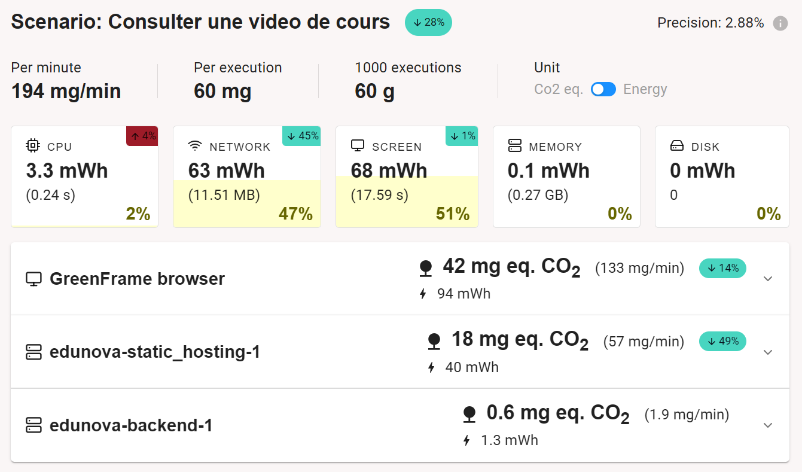

# EduNova
Plateforme d'apprentissage en ligne soucieuse de son impact écologique.

## Unis par l’apprentissage autonome et accessible
Nous serons, en tant qu'ingénieurs, intégrés à un environnement de travail en constante évolution. Nous avons besoin de pouvoir monter en compétences et de suivre les dernières tendances de notre secteur d’activités.

Nous sommes également, en tant que jeunes adultes, des personnes curieuses de se développer personnellement et de s’investir dans divers loisirs.

L’apprentissage en ligne représente pour nous une activité fréquente et indispensable. Au-delà de nos usages personnels, le marché du e-learning concerne également les entreprises, les salariés et les universités. Il s'agit d'une bonne option pour les entreprises qui veulent former leurs employés à Python par exemple. C’est un marché en forte croissance (croissance d’environ 10% par an depuis 2020), et qui touche de plus en plus de catégories socio-économiques.

## L’apprentissage en ligne pour favoriser l’éducation
L’éducation est un pilier de la société. Elle permet :
-	le développement économique du territoire,
-	l’insertion des individus dans les activités de la société,
-	d’améliorer la stabilité sociale (transmission de valeurs, esprit critique, individus plus responsables, …).

L’éducation est une ressource qui peut s’avérer difficile d’accès. Néanmoins, 2/3 de la population mondiale à aujourd’hui accès à Internet. L’apprentissage en ligne s’impose alors comme un moyen naturel d’améliorer l’accessibilité et la diffusion du savoir à plus grande échelle, pour améliorer l’accès à l’éducation.

## Impact écologique de la numérisation de l’éducation
Du fait de son importance sociale, et de l'échelle important du marché du e-learning, nous avons trouvé pertinent de comprendre son impact écologique.

À première vue, la transition numérique de l’éducation et des formations tendrait à réduire l'empreinte carbone des formations / séminaires par subsitution. Elle doit en théorie limiter certains facteurs, que l'on peut unitairement quantifier en moyenne par :
- 50g de CO2 par passager par km pour le transport ([Rapport ADEME](https://impactco2.fr/outils/transport)),
- 10kg de CO2 par personne par nuit pour l’hébergement et la restauration ([Rapport ADEME](https://nosgestesclimat.fr/documentation/logement/vacances/empreinte-hotel-par-nuit)),
- utilisation de support (papier ou numérique) difficile à quantifier.
Néanmoins, même si l'effet de subsitution existe, il reste assez difficile à quantifier à l'échelle d'un pays, et il n'est pas systématique (il existe toujours des séminaires et des formations où la présence physique est nécessaire).

Puis, si l'on s'intéresse de plus près à l'impact écologique de l'éducation en ligne, on observe qu'elle créé un flux numérique qui est à considérer (notamment par le flux vidéo). En effet, selon plusieurs sources, on peut quantifier l'empreinte carbone d'une heure de streaming vidéo : entre 30 et 55g de CO2 ([Article Netflix](https://about.netflix.com/fr/news/the-true-climate-impact-of-streaming), [Reportage TF1](https://www.tf1info.fr/environnement-ecologie/non-l-empreinte-carbone-d-une-heure-de-streaming-quotidien-en-un-an-n-est-pas-egale-a-celle-d-un-vol-paris-new-york-2245161.html)). Les principales émissions sont cachées : la majeure partie des émissions proviennent du fonctionnement permanent des infrastructures qui composent Internet, un levier sur lequel on ne peut pas agir. Le coût proposé ci-dessus est net de ces émissions, et ne représente que le coût réel de transmission des données à travers Internet. 

Enfin, le e-learning porte en lui la volonté d'être le plus démocratisé et accessible possible, soumettant la plupart des projets qui y sont liés à l'effet rebond. 

Pour réussir à produire une plateforme de e-learning avec un impact carbone minime, il faut minimiser l'action de ce que l'on peut maîtriser :
- Encourager les créateurs de contenus à s'orienter vers des supports de transmission plus sobres (image, texte, audio), et n'utiliser la vidéo uniquement lorsque cela est nécessaire
- Limiter au mieux l'empreinte carbone de diffusion de supports à forte émissions, en compressant par exemple les données

## Scénario prioritaire : Consulter une vidéo de cours
Nous nous mettons ici à la place d'un étudiant, qui souhaite se former au deep learning sur internet. Le scénario consiste à accéder à une vidéo avec les étapes suivantes:
1. Se rendre sur la page d'accueil
2. Se connecter
3. Aller sur la page de sélection des cours
4. Sélectionner le cours
5. Lancer la vidéo

Nous avons étudié l'impact d'un tel scénario sur deux plateformes connues dans le monde du e-learning, à savoir Coursera et OpenClassrooms. Ces 2 sites utilisent des CAPTCHAs afin de se connecter, nous avons donc du utiliser l'extension Chrome de Green IT pour réaliser notre étude. Les résultats sont disponibles dans [benchmark.md](https://github.com/UTT-GL03/EduNova/blob/main/benchmark.md).

## Interfaces et jeu de données

En parcourant les différents sites de e-learning, nous avons identifié deux interfaces principales qui permettent de rendre le site utilisable et fonctionnel : 
- une page avec un ensemble de vidéos de cours,
- une fois la vidéo sélectionnée, une nouvelle page s'affiche, permettant de lire la vidéo et d'afficher une transcription en temps réel.

__Fig.1__: Maquette de l'interface pour le choix du cours

__Fig.2__: Maquette de l'interface pour regarder une vidéo sélectionnée

## Prototype n°1 : Scénario prioritaire avec chargement statique des données

Pour cette première version du prototype :
- l'ensemble des données liées aux cours est chargé dans le code de manière statique,
- les fonctionnalités implémentées ne sont que celles nécessaires pour suivre le scénario prioritaire ("Consulter une vidéo de cours").

Nous avons créé une page d'accueil listant les vidéos disponibles (cf. Fig. 3), afin que l'utilisateur puisse sélectionner une vidéo à consulter. Nous avons utilisé un framework de mise en page minimaliste ([PicoCSS](https://picocss.com/)), et React pour construire notre site.

__Fig.3__: Prototype de la page d'accueil, présentant les vidéos de cours.

Afin de pouvoir exécuter notre scénario, nous avons également conçu une page permettant de consulter les vidéos de cours, en respectant les choix de notre maquette. Cette page est accessible en cliquant sur une miniature.

__Fig.4__: Prototype de la page d'une vidéo, avec sa transcription et son titre.

Pour nous donner une première idée, un benchmark de l'impact environnemental de la page d'accueil a été réalisé pour nous comparer aux autres acteurs du domaine. Les résultats sont encourageants, car la note des autres sites oscille entre E et G.
En reprenant notre [scénario n°1](benchmark.md) pour évaluer l'impact en simulant une utilisation normale, on obtient ce tableau de résulats :

| Scénario                                | Nombre requêtes | Taille (ko) | Taille du dom | GES (gCO2e)  | ecoIndex | Note              |
| --------------------------------------- | --------------- | ----------- | ------------- | ---- | -------- | ----              |
| Chargement de la page d’accueil         | 5               | 342         | 46            | 1,14 | 92,88    | :green_circle: A    |
| Choisir un cours                        | 6               | 412       | 29       | 1,13 | 93,30     | :green_circle: A    |
| Visionnage du cours                     | 7               | 18 637      | 29         | 1,39  | 80,28     | :green_circle: A    |
| Total                                   | **18**          | **19 391**  | **104**    | **3,66** |          |                   |

__Tab.1__: Évaluation de l'impact du scénario "Consulter une vidéo de cours" dans le prototype n°1.

## Prototype n°2 : Scénario prioritaire avec chargement dynamique des données

Dans cette version du prototype, les données statiques sont désormais chargées par le frontend à travers le réseau immédiatement après un premier affichage à vide.

En ce qui concerne l'évaluation de l'impact environnemental du scénario, les résultats, à l'exception du nombre de requêtes incrémenté de 1, restent identiques à ceux présentés dans le tableau précédent (cf. Tab.1). Par ailleurs, à partir de cette version, sauf modifications majeures, l'EcoIndex ne devrait plus subir d'évolution significative. Nous passerons désormais à l'utilisation d'un autre outil, GreenFrame, qui se concentre sur l'évaluation de l'impact direct de la consultation (sans inclure la contribution au cycle de vie du terminal). Cet outil, plus fiable, s'appuie sur les statistiques d'utilisation des ressources physiques (CPU, mémoire, réseau, disque) pour fournir une analyse précise. Pour utiliser GreenFrame, nous avons du déployer notre application avec Docker.

Dans le cas de notre prototype, le graphique (cf. Fig. 5) révèle un seul pic notable de consommation, à la fois pour le CPU et le réseau. De plus, cette consommation ne représente que 3 % de la consommation totale mesurée, le reste étant majoritairement attribué à l'écran sur toute la durée de l'analyse. Cela s'explique par le fait que les photos, vidéos et données quantitatives utilisées pour les cours sont encore statiques à ce stade.

__Fig.5__: Consommation des ressources par le client lors de la consultation de la page d'accueil de notre site.

Par ailleurs, il nous est possible désormais d'évaluer l'impact écologique de la partie "serveur", possiblement hébergée par un data center (cf. Fig.6). Réduite au simple hébergement de données statiques sur un serveur Web, cette partie a pour l'instant un impact largement inférieur à la partie "client" grâce à l'absence d'écran qui représentait 97% de la consomation (cf. Fig.5).

__Fig.6__: Consommation de ressources par le serveur Web lors de la consultation d'un cours dans notre prototype.

Pour avoir un point de comparaison, voici le rapport sur un site OpenClassroom, une référence du domaine (cf. Fig.7). Sur OpenClassrooms, la vidéo est chargée au moment du lancement par l'utilisateur déjà authentifié (clique sur le bouton "play"). Comme il est impossible de s'authentifier via greenframe, le scénario de consultation de la page de cours n'inclue pas l'impact de chargement de la vidéo du cours.

On voit que la consommation est supérieure sur tous les points, même sans vidéo, notamment au niveau de la consommation de l'écran et du CPU.

__Fig.7__: Consommation des ressources par le client lors de la consultation de la page d'accueil d'un cours sur OpenClassrooms.

Lorsqu'on regarde une vidéo, on observe une hausse important de la consommation du réseau, liée à la transmission du fichier vidéo (cf. Fig. 8 et Fig. 9).

__Fig.8__: Consommation des ressources par le client lors de la consultation d'une video de cours de notre site.

__Fig.9__: Consommation des ressources par le serveur Web lors de la consultation d'une video de cours de notre site.

## Prototype n°3 Intégration d'une base de données pour le scénario principal

Pour la troisième version du prototype, les données sont désormais stockées dans un système de base de données interrogeable à travers une API Web (CouchDB). L'intérêt d'une source de données dynamique est d'une part, à terme, de pouvoir ajouter ou modifier des articles plus facilement, et d'autre part de déporter sur le serveur le filtrage des données pertinentes.

__Fig.10__: Consommation des ressources par le client lors de la consultation de la page d'accueil de notre site.

__Fig.11__: Consommation de ressources par le serveur Web lors de la consultation d'un cours dans notre prototype.

__Fig.12__: Consommation de ressources par le serveur Web lors de la consultation d'un cours dans notre prototype.

__Fig.13__: Consommation des ressources par le client lors de la consultation d'une video de cours de notre site.

__Fig.14__: Consommation des ressources par le serveur Web lors de la consultation d'une video de cours de notre site.

__Fig.15__: Consommation des ressources par CouchDB lors de la consultation d'une video de cours de notre site.

Cette baisse d'impact du réseau est cependant largement compensée par une utilisation du CPU par la base de données, utilisation qui semble par ailleurs continue (cf. Fig. 15).

## Prototype n°4 Passage à l'échelle
On simule le passage à des centaines de créateurs en augmentant de 20 à 2000 le nombre de vidéos (environ 20 vidéos par créateurs, soit 1 à 2 mois de travail environ). Dans cette partie, on ne s'intéresse qu'à la consommation en ressources de la page d'accueil. En effet, la consultation d'une vidéo de cours n'est pas impactée par le passage à l'échelle : qu'il y ait 20 ou 2000 vidéos, la page de consultation n'en charge qu'une seule. Nous obtiendrions les même résultats que les précédents.

Le changement le plus frappant, mais prévisible, est l'augmentation de l'utilisation du réseau par CouchDB (Fig.17) et par le client (cf Fig. 16). En effet, lors du chargement de la page d'accueil, les 2000 miniatures des vidéos de cours (2000 images de 0,228 Mo) sont requêtées à travers le réseau. Nous avons volontairement retiré l'utilisation du cache, pour simuler le fait que toutes les miniatures chargées par le site sont différentes. On observe également une augmentation considérable de l'utilisation du CPU.

En passant de 20 à 2000, on multiplie environ par 100 l'utilisation du réseau, et par 20 l'utilisation CPU du client et de CouchDB.

__Fig.16__: Consommation des ressources par le client lors de la consultation d'une video de cours de notre site.

__Fig.17__: Consommation des ressources par la base de données lors du chargement de la page d'accueil.

Pour limiter les effets de mise à l'échelle, on réduit le nombre d'items chargé dans la page principale par la requête à la base de données (24 items par requête). Cela est une solution qui semble raisonnable, étant donné qu'un utilisateur n'a pas besoin que le site charge tous les cours disponibles. On intègre un mécanisme de pagination, qui au clic de l'utilisateur, permet de charger plus de vidéos que les 24 initiales.

Comme on limite le nombre de cours affichés à l'utilisateurs, il faut choisir les cours pertinents à afficher. On peut choisir parmi 3 stratégies :
- Afficher en premier les cours les plus récents (publiés le plus proche de la date de consultation)
- Afficher en premier les cours à l'aide d'un algorithme de recommandation (pertinence, vidéo pour lesquelles l'utilisateur n'a pas fini le visionnage, ...)
- Afficher les cours les plus populaires

De par le coût en ressources et la complexité d'un algorithme de recommandation, nous nous sommes orientés vers une solution plus simple. Etant donné que nous n'avons pas de métrique de popularité car notres site n'est pas déployé, nous avons décidé que les cours les plus récemment publiés sont affichés en premier à l'utilisateur. Cela va permettre de limiter le nombre de pages que l'utilisateur va devoir consulter, et donc la consommation réseau.

Le résultat de cette décision a largement diminué la consommation réseau pour le chargement d'une page de 24 miniatures de vidéos (cf. Fig. 18). De plus, on note que nous disposons de 2000 vidéos, ce qui fait en théorie 83 pages. Il y a de fortes chances pour que l'utilisateur en charge moins, ce qui optimise considérablement notre site par rapport à celui où nous chargions les 2000 miniatures d'un coup.

__Fig.18__: Consommation des ressources par la base de données lors du chargement de la page d'accueil. Valeurs de référence pour la comparaison : Scénario de mise à l'échelle, avec le chargement des 2000 items.

## Prototype n°5 Compression des vidéos

On voit que la compression des vidéos réduit la consommation réseau, ce qui était assez prévisible étant donnée que la taille des fichiers vidéos est réduite. On note cependant que le coût énergétique du visionnage d'une vidéo reste important, et qu'il vaut mieux encourager d'autres types de support plus sobres pour transmettre l'information lorsqu'une vidéo n'est pas nécessaire (graphique, image, audio, texte, ...).

__Fig.19__: Consommation des ressources par la base de données lors du chargement d'une vidéo de cours, compressée au format webm. Valeurs de référence pour la comparaison : Scénario avec la requête Mango.

## Conclusion

En conclusion, notre étude a permis d’évaluer l'impact écologique d'une application de e-learning tout en identifiant des enseignements clés. Le premier prototype, avec un chargement statique des données, a montré des résultats très positifs en termes de consommation énergétique et d’émissions carbone, notamment grâce à une architecture simplifiée et une gestion statique des ressources. Cependant, il est rapidement apparu que cette approche n’était pas scalable. Le second prototype, intégrant un chargement dynamique, a introduit une consommation légèrement accrue, notamment sur le réseau, mais a permis une meilleure flexibilité et une analyse détaillée des impacts via GreenFrame. L’intégration d’une base de données dans le troisième prototype a permis une meilleure performance pour la gestion des données (index, filtrage), mais au prix d’une augmentation de la consommation du CPU, particulièrement notable au niveau du serveur. Enfin, le passage à l’échelle, simulé dans le quatrième prototype, a mis en lumière les défis liés à la gestion massive de données, notamment en termes de consommation réseau et de CPU. La mise en place d’une pagination et d’une stratégie d’affichage des vidéos les plus récentes s’est avérée être une solution efficace pour limiter ces impacts.

Ce projet a été marqué par plusieurs surprises : l’impact prédominant de l’écran dans la consommation énergétique, l’importance de la compression et de la gestion du réseau pour minimiser les émissions, et les limites des approches statiques face à des volumes importants de données. À retenir, une conception écologique d’une plateforme de e-learning doit s’appuyer sur une architecture optimisée, des choix technologiques sobres, et des mécanismes adaptés au passage à l’échelle, tout en conservant une expérience utilisateur de qualité. Il faut également éviter au maximum le format vidéo, consommant beaucoup de ressources réseau, et favoriser d'autres format plus sobre quand cela est possible (texte, image, audio, graphiques, ...).

## Perspectives

Nous aurions aimé tester d'autres fonctionnalités, qui auraient pu être sujet à des études pertinentes sur l'impact écologique de celles-ci. 

Tout d'abord, la mise en place d'un reverse proxy comme HAProxy par exemple. Celui-ci permettrait de mettre en cache les réponses du serveur, de les compresser et d'utliser le multiplexage présent dans [HTTP/2](https://developer.mozilla.org/fr/docs/Glossary/HTTP_2).

On peut aussi penser à l'intégration d'un système de recommandation basé sur des algorithmes de machine learning sobres en énergie qui pourrait enrichir l'expérience utilisateur en proposant des contenus personnalisés tout en optimisant les ressources. Cette fonctionnalité pourrait être pensée avec des techniques d'apprentissage décentralisé, telles que l'apprentissage fédéré, afin de limiter les échanges de données et réduire l'empreinte carbone. Elle pourrait utiliser un modèle peu complexe, pour limiter la consommation liée à l'inférence.

Par ailleurs, nous souhaitions que la plateforme ait un aspect collaboratif. L’implémentation de fonctionnalités de collaboration, comme des espaces de travail partagés ou des forums interactifs, pourrait renforcer l’aspect communautaire de la plateforme. Cependant, ces développements nécessitent une réflexion approfondie sur l’équilibre entre l’enrichissement fonctionnel, l’impact énergétique et l'impact du comportement des utilisateurs.
